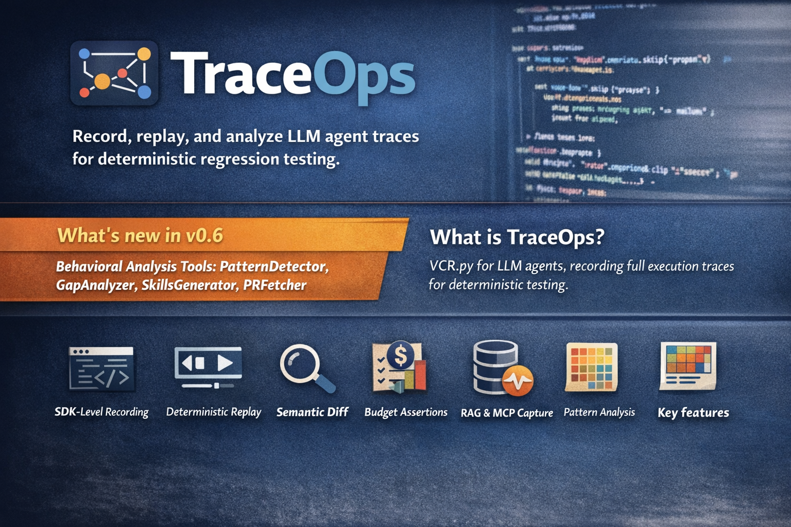

# 🔁 TraceOps

**Record, replay, and analyze LLM agent traces for deterministic regression testing.**

[](https://pypi.org/project/traceops/)
[](https://pypi.org/project/traceops/)
[](https://opensource.org/licenses/MIT)
[](https://github.com/ioteverythin/TraceOps)



TraceOps brings the VCR.py pattern to LLM agents — but at the **SDK level**, not the HTTP level. It intercepts `openai.chat.completions.create`, `anthropic.messages.create`, tool calls, and agent decisions, recording the full execution trace. On replay, it injects recorded responses — **zero API calls, millisecond execution, fully deterministic**. It also includes behavioral analysis tools inspired by [agent-pr-replay](https://github.com/sshh12/agent-pr-replay) to surface patterns, gaps, and guidance across entire cassette libraries.

## Why not just use VCR.py?

VCR.py records HTTP traffic. TraceOps records **agent behavior**:

| | VCR.py / Cagent | TraceOps |
|---|---|---|
| **Records at** | HTTP layer | SDK layer |
| **Understands** | Request/response pairs | LLM calls, tool invocations, agent decisions |
| **Trajectory tracking** | ❌ | ✅ "agent called search, then read_file, then responded" |
| **Regression diff** | Binary (match/no-match) | Semantic ("model changed", "new tool used", "extra LLM call") |
| **Framework-agnostic** | ✅ | ✅ (OpenAI, Anthropic, LiteLLM, LangChain, CrewAI) |
| **Cost tracking** | ❌ | ✅ per-call tokens and USD |
| **Async + Streaming** | Varies | ✅ Native support |
| **RAG / MCP support** | ❌ | ✅ Retrieval events, chunk scoring, MCP tool calls |
| **Behavioral analysis** | ❌ | ✅ Pattern detection, gap analysis, AGENTS.md generation |

## Quick Start

```bash
pip install traceops
# With optional provider support:
pip install traceops[openai]           # OpenAI
pip install traceops[anthropic]        # Anthropic
pip install traceops[langchain]        # LangChain/LangGraph
pip install traceops[crewai]           # CrewAI
pip install traceops[rag]              # RAG scoring (ragas, deepeval)
pip install traceops[all]              # Everything
```

### Record an agent run

```python
from trace_ops import Recorder

with Recorder(save_to="cassettes/test_math.yaml") as rec:
    response = client.chat.completions.create(
        model="gpt-4o",
        messages=[{"role": "user", "content": "What is 2+2?"}],
    )

print(f"Recorded {rec.trace.total_llm_calls} LLM calls, ${rec.trace.total_cost_usd:.4f}")
```

### Replay deterministically

```python
from trace_ops import Replayer

with Replayer("cassettes/test_math.yaml"):
    # Same code — LLM calls return recorded responses
    # Zero API calls, zero cost, millisecond execution
    response = client.chat.completions.create(
        model="gpt-4o",
        messages=[{"role": "user", "content": "What is 2+2?"}],
    )
    assert response.choices[0].message.content  # deterministic!
```

### Async & Streaming (v0.2)

```python
# Async
async with Recorder(save_to="cassettes/async_test.yaml"):
    response = await client.chat.completions.create(...)

# Streaming — assembled automatically, replayed as realistic chunks
with Recorder(save_to="cassettes/stream_test.yaml"):
    for chunk in client.chat.completions.create(..., stream=True):
        print(chunk.choices[0].delta.content or "", end="")
```

### Regression testing with pytest

```python
from trace_ops import assert_trace_unchanged, load_cassette

def test_agent_regression():
    old_trace = load_cassette("cassettes/test_agent.yaml")
    with Recorder() as rec:
        agent.run("Summarize the quarterly report")
    assert_trace_unchanged(old_trace, rec.trace)
```

### pytest plugin (auto record/replay)

```python
# Uses the cassette fixture — records on first run, replays on subsequent runs
def test_agent(cassette):
    agent.run("Summarize the quarterly report")
```

```bash
pytest --record        # record cassettes
pytest                 # replay from cassettes
pytest --record-mode=all  # re-record everything
```

---

## Budget Assertions (v0.2)

Guard against cost overruns, token bloat, and infinite loops:

```python
from trace_ops.assertions import assert_cost_under, assert_tokens_under, assert_max_llm_calls, assert_no_loops

def test_agent_budget():
    with Recorder() as rec:
        agent.run("Summarize the report")

    assert_cost_under(rec.trace, max_usd=0.50)
    assert_tokens_under(rec.trace, max_tokens=10_000)
    assert_max_llm_calls(rec.trace, max_calls=5)
    assert_no_loops(rec.trace, max_consecutive_same_tool=3)
```

Or use the pytest marker:

```python
@pytest.mark.budget(max_usd=0.50, max_tokens=10_000, max_llm_calls=5)
def test_agent(cassette):
    agent.run("Summarize the report")
```

---

## RAG Recording & Assertions (v0.5)

Record retrieval events, chunk scores, and vector store queries alongside LLM calls:

```python
from trace_ops import Recorder
from trace_ops.rag import assert_chunk_count, assert_min_relevance_score, assert_no_retrieval_drift

with Recorder(save_to="cassettes/rag_test.yaml") as rec:
    # TraceOps captures retrieval queries, chunks, scores automatically
    answer = rag_pipeline.run("What is the refund policy?")

# Assert retrieval quality
assert_chunk_count(rec.trace, min_chunks=3)
assert_min_relevance_score(rec.trace, min_score=0.75)

# Detect retrieval drift between versions
old_trace = load_cassette("cassettes/rag_baseline.yaml")
assert_no_retrieval_drift(old_trace, rec.trace, tolerance=0.1)
```

### RAG scoring integrations

```python
from trace_ops.rag import RagasScorer, DeepEvalScorer

scorer = RagasScorer()  # or DeepEvalScorer()
scores = scorer.score(rec.trace)
print(scores)
# {"faithfulness": 0.92, "answer_relevancy": 0.88, "context_precision": 0.85}
```

---

## Semantic Regression Detection (v0.5)

Catch meaning-level regressions that exact-string diffs miss:

```python
from trace_ops.semantic import assert_semantic_similarity, SemanticRegressionError

old = load_cassette("cassettes/v1.yaml")
new_trace = rec.trace

# Fails if any response drifts more than 15% semantically
assert_semantic_similarity(old, new_trace, threshold=0.85)
```

---

## MCP Tool Recording (v0.5)

Record Model Context Protocol tool calls and server connections:

```python
from trace_ops import Recorder

with Recorder(save_to="cassettes/mcp_test.yaml", intercept_mcp=True) as rec:
    # MCP server connections, tool calls, and results are captured
    result = await mcp_client.call_tool("search_files", {"query": "config.py"})

# Inspect MCP events
mcp_events = rec.trace.mcp_events
print(f"MCP calls: {len(mcp_events)}")
```

---

## Fine-Tune Dataset Export (v0.5)

Export recorded traces as fine-tuning datasets:

```python
from trace_ops.export.finetune import export_finetune_jsonl, ExportFormat

# Export as OpenAI fine-tune JSONL
export_finetune_jsonl(
    cassette_dir="cassettes/",
    output_path="dataset.jsonl",
    fmt=ExportFormat.OPENAI,
)

# Or Anthropic format
export_finetune_jsonl(cassette_dir="cassettes/", fmt=ExportFormat.ANTHROPIC)
```

---

## Behavioral Pattern Analysis (v0.6 — agent-pr-replay inspired)

Analyze patterns across hundreds of cassettes and compare agent behavior to golden baselines. Inspired by [sshh12/agent-pr-replay](https://github.com/sshh12/agent-pr-replay).

### PatternDetector — tool heatmaps & model stats

```python
from trace_ops.analysis import PatternDetector

detector = PatternDetector(window_size=3, top_n=10)
report = detector.analyze_dir("cassettes/")

print(report.summary())
# Analyzed 47 traces | Avg: 3.2 LLM calls, 1,450 tokens, $0.012/run

for seq in report.top_tool_sequences:
    print(f"  {' → '.join(seq.sequence):<35} ×{seq.count}")
# search → read_file → write_file          ×31
# search → read_file                       ×9
```

### GapAnalyzer — compare agent vs golden baseline

```python
from trace_ops.analysis import GapAnalyzer

golden = [("g1.yaml", load_cassette("golden/g1.yaml")), ...]
agent  = [("a1.yaml", load_cassette("runs/a1.yaml")), ...]

report = GapAnalyzer().compare(golden, agent)
print(report.summary())
# Found 3 behavioral gap(s): 1 critical, 2 warnings

for gap in report.gaps:
    print(f"[{gap.severity.upper()}] {gap.description}")
# [CRITICAL] Agent uses 4.2× more tokens than golden baseline (avg 1,820 vs 430)
# [WARNING]  Agent never uses 'write_file' — present in 80% of golden traces
# [WARNING]  Error rate 33% vs golden 0%
```

Gaps detected automatically: `token_inflation`, `cost_inflation`, `missing_tool`, `extra_tool`, `model_mismatch`, `error_rate`, `llm_call_inflation`. Exits with code 1 if critical gaps exist — **CI-friendly**.

### SkillsGenerator — auto-produce AGENTS.md guidance

```python
from trace_ops.analysis import SkillsGenerator

gen = SkillsGenerator()

# From gap analysis → AGENTS.md style steering doc
md = gen.from_gap_report(gap_report, output_path="AGENTS.md")

# From pattern analysis → pattern summary doc
md = gen.from_pattern_report(pattern_report, output_path="PATTERNS.md")
```

---

## GitHub PR Integration (v0.6)

Fetch merged GitHub PRs as golden baselines — no CLI required, uses stdlib `urllib` only.

```python
from trace_ops.github import PRFetcher

fetcher = PRFetcher(token="ghp_...")  # or set GITHUB_TOKEN env var

# Fetch a single PR
pr = fetcher.fetch("https://github.com/owner/repo/pull/123")
print(pr.extract_task_prompt())   # reverse-engineers a plain-English task
print(pr.diff_text)               # unified diff of all changed files

# Fetch recent merged PRs as golden baselines
recent = fetcher.fetch_recent("https://github.com/owner/repo", limit=10)
```

---

## Framework Integrations

### LangGraph (v0.3)

```python
with Recorder(save_to="cassettes/graph.yaml", intercept_langgraph=True):
    result = graph.invoke({"messages": [...]})
```

### LangChain (v0.3)

```python
with Recorder(save_to="cassettes/agent.yaml", intercept_langchain=True):
    result = agent.invoke({"input": "your question"})
```

---

## What Gets Recorded

Every LLM call captures: **provider**, **model**, **messages**, **response**, **tool calls**, **tokens**, **cost**, **timing**.

Plus: **RAG retrieval events** (query, chunks, scores, vector store), **MCP tool calls** (server, tool name, args, result), **agent decisions**, **errors**.

## Supported Providers

| Provider | Auto-intercepted | Sync | Async | Streaming |
|----------|-----------------|------|-------|-----------|
| OpenAI | ✅ | ✅ | ✅ | ✅ |
| Anthropic | ✅ | ✅ | ✅ | ✅ |
| LiteLLM | ✅ | ✅ | ✅ | ✅ |
| LangChain | ✅ | ✅ | ✅ | — |
| LangGraph | ✅ | ✅ | ✅ | ✅ |
| CrewAI | ✅ | ✅ | ✅ | — |
| Any (manual) | `rec.record_tool_call()` | ✅ | ✅ | — |

---

## Trace Diffing

```python
from trace_ops import diff_traces, load_cassette

old = load_cassette("cassettes/v1.yaml")
new = load_cassette("cassettes/v2.yaml")
diff = diff_traces(old, new)
print(diff.summary())
# ⚠ TRAJECTORY CHANGED
#   Old: llm_call:gpt-4o → tool:search → llm_call:gpt-4o
#   New: llm_call:gpt-4o → tool:browse → tool:search → llm_call:gpt-4o
```

---

## CLI

```bash
# Inspect / compare / export
traceops inspect cassettes/test.yaml
traceops diff cassettes/old.yaml cassettes/new.yaml
traceops export cassettes/test.yaml --format json -o trace.json

# Interactive time-travel debugger
traceops debug cassettes/test.yaml
traceops debug cassettes/v1.yaml --compare cassettes/v2.yaml

# Cassette management
traceops ls cassettes/
traceops stats cassettes/
traceops prune cassettes/ --older-than 30d --dry-run
traceops validate cassettes/test.yaml

# HTML report
traceops report cassettes/test.yaml -o report.html

# Behavioral pattern analysis (v0.6)
traceops analyze cassettes/          # tool heatmaps + model stats
  --window 3                         # n-gram window size
  -o report.json                     # save PatternReport as JSON
  --skills AGENTS.md                 # also write guidance doc

# Gap analysis vs golden baseline (v0.6)
traceops gap-report golden/ runs/
  -o gaps.json
  --skills AGENTS.md
  # exits with code 1 if critical gaps found (CI-friendly)

# Fetch a GitHub PR as golden baseline (v0.6)
traceops pr-diff https://github.com/owner/repo/pull/123
  --token ghp_...
  --task                             # print reverse-engineered task prompt
  --files                            # list changed files with +/- stats
```

---

## Time-Travel Debugger

```
$ traceops debug cassettes/test_math.yaml

╭─ 🔁 TraceOps debugger ──────────────────────╮
│ Trace ID: abc123                             │
│ Events: 6  (LLM: 2, Tools: 1)               │
│ Tokens: 450  Cost: $0.0015  Duration: 1200ms │
╰──────────────────────────────────────────────╯
  n/Enter = next · p = prev · q = quit · g <N> = go to event N

LLM Response  #2/6  model=gpt-4o  350ms
╭─ Response ────────────────────╮
│ The answer is 4.              │
╰───────────────────────────────╯
  Tokens: in=100, out=25, $0.0005
```

---

## Roadmap

| Version | Status | Highlights |
|---------|--------|-----------|
| v0.1 | ✅ released | Record/replay, pytest plugin, diff engine, CLI |
| v0.2 | ✅ released | Async + streaming, budget assertions, time-travel debugger, HTML reports |
| v0.3 | ✅ released | LangGraph Pregel interceptor, Anthropic tool_use, framework integration tests |
| v0.4 | ✅ released | Normalization, cost dashboard, expanded reporters |
| v0.5 | ✅ released | RAG recording + scoring, semantic regression, MCP tool calls, fine-tune export |
| v0.6 | ✅ released | Behavioral analysis (PatternDetector, GapAnalyzer, SkillsGenerator), GitHub PR integration |
| v0.7 | 🔜 planned | VS Code extension, live replay dashboard, web UI for cassette inspection |

---

## License

MIT — see [LICENSE](LICENSE).


VCR.py records HTTP traffic. TraceOps records **agent behavior**:

| | VCR.py / Cagent | TraceOps |
|---|---|---|
| **Records at** | HTTP layer | SDK layer |
| **Understands** | Request/response pairs | LLM calls, tool invocations, agent decisions |
| **Trajectory tracking** | ❌ | ✅ "agent called search, then read_file, then responded" |
| **Regression diff** | Binary (match/no-match) | Semantic ("model changed", "new tool used", "extra LLM call") |
| **Framework-agnostic** | ✅ | ✅ (OpenAI, Anthropic, LiteLLM, LangChain, CrewAI) |
| **Cost tracking** | ❌ | ✅ per-call tokens and USD |
| **Async + Streaming** | Varies | ✅ Native support |

## Quick Start

```bash
pip install TraceOps
# With optional provider support:
pip install TraceOps[openai]           # OpenAI
pip install TraceOps[anthropic]        # Anthropic
pip install TraceOps[langchain]        # LangChain/LangGraph
pip install TraceOps[langgraph]        # LangGraph (includes langchain-core)
pip install TraceOps[crewai]           # CrewAI
pip install TraceOps[all]              # Everything
```

### Record an agent run

```python
from trace_ops import Recorder

with Recorder(save_to="cassettes/test_math.yaml") as rec:
    # Your agent code here — all LLM calls are automatically captured
    response = client.chat.completions.create(
        model="gpt-4o",
        messages=[{"role": "user", "content": "What is 2+2?"}],
    )
    print(response.choices[0].message.content)

# Trace saved to cassettes/test_math.yaml
print(f"Recorded {rec.trace.total_llm_calls} LLM calls")
```

### Async support (v0.2)

```python
from trace_ops import Recorder

async with Recorder(save_to="cassettes/async_test.yaml") as rec:
    response = await client.chat.completions.create(
        model="gpt-4o",
        messages=[{"role": "user", "content": "Hello!"}],
    )
```

### Streaming support (v0.2)

Streaming calls are automatically captured and assembled into complete responses in the cassette. On replay, responses are split back into realistic chunks:

```python
with Recorder(save_to="cassettes/stream_test.yaml") as rec:
    stream = client.chat.completions.create(
        model="gpt-4o",
        messages=[{"role": "user", "content": "Tell me a story"}],
        stream=True,
    )
    for chunk in stream:
        print(chunk.choices[0].delta.content or "", end="")
```

### Replay deterministically

```python
from trace_ops import Replayer

with Replayer("cassettes/test_math.yaml"):
    # Same code — but LLM calls return recorded responses
    # Zero API calls, zero cost, millisecond execution
    response = client.chat.completions.create(
        model="gpt-4o",
        messages=[{"role": "user", "content": "What is 2+2?"}],
    )
    assert response.choices[0].message.content  # deterministic!
```

### Regression testing with pytest

```python
import pytest
from trace_ops import Recorder, Replayer, assert_trace_unchanged, load_cassette

# First run: record
def test_agent_record():
    with Recorder(save_to="cassettes/test_agent.yaml"):
        agent.run("Summarize the quarterly report")

# Subsequent runs: replay and check for regressions
def test_agent_regression():
    old_trace = load_cassette("cassettes/test_agent.yaml")
    with Recorder() as rec:
        agent.run("Summarize the quarterly report")
    assert_trace_unchanged(old_trace, rec.trace)
```

### Using the pytest plugin (auto record/replay)

```python
# Uses the cassette fixture — automatically records on first run,
# replays on subsequent runs
def test_agent(cassette):
    agent.run("Summarize the quarterly report")
```

```bash
# First run: record cassettes
pytest --record

# Subsequent runs: replay from cassettes
pytest

# Re-record all cassettes
pytest --record-mode=all
```

### Budget assertions (v0.2)

Guard against cost overruns, token bloat, and infinite loops:

```python
import pytest
from trace_ops import Recorder
from trace_ops.assertions import (
    assert_cost_under,
    assert_tokens_under,
    assert_max_llm_calls,
    assert_no_loops,
)

def test_agent_budget():
    with Recorder() as rec:
        agent.run("Summarize the report")

    assert_cost_under(rec.trace, max_usd=0.50)
    assert_tokens_under(rec.trace, max_tokens=10_000)
    assert_max_llm_calls(rec.trace, max_calls=5)
    assert_no_loops(rec.trace, max_consecutive_same_tool=3)
```

Or use the pytest marker:

```python
@pytest.mark.budget(max_usd=0.50, max_tokens=10_000, max_llm_calls=5)
def test_agent(cassette):
    agent.run("Summarize the report")
```

## What Gets Recorded

Every LLM call captures:
- **Provider** (openai, anthropic, litellm, langchain, crewai)
- **Model** (gpt-4o, claude-4-sonnet, etc.)
- **Messages** (full prompt including system message)
- **Response** (full completion response)
- **Tool calls** (function name, arguments, tool_call_id)
- **Tokens** (input/output counts)
- **Cost** (USD per call)
- **Timing** (milliseconds per call)

Plus agent-level events:
- **Tool invocations** (name, input, output)
- **Agent decisions** (delegation, routing, planning)
- **Errors** (exceptions with type and message)

## Supported Providers

| Provider | Auto-intercepted | Sync | Async | Streaming | Package |
|----------|-----------------|------|-------|-----------|---------|
| OpenAI | ✅ | ✅ | ✅ | ✅ | `openai` |
| Anthropic | ✅ | ✅ | ✅ | ✅ | `anthropic` |
| LiteLLM | ✅ | ✅ | ✅ | ✅ | `litellm` |
| LangChain | ✅ | ✅ | ✅ | — | `langchain-core` |
| LangGraph | ✅ | ✅ | ✅ | ✅ | `langgraph` |
| CrewAI | ✅ | ✅ | ✅ | — | `crewai` |
| Any (manual) | Via `rec.record_tool_call()` | ✅ | ✅ | — | — |

## Framework Integrations (v0.3)

TraceOps now captures **graph-level** and **framework-level** events.

### LangGraph

Record Pregel graph execution with node and stream-level events:

```python
from trace_ops import Recorder
from langgraph.graph import StateGraph

with Recorder(save_to="cassettes/graph.yaml", intercept_langgraph=True):
    # Captured: graph_start, graph_stream_start/end, graph_end
    result = graph.invoke({"messages": [...]})
```

### LangChain

Intercept `BaseChatModel` calls in agents, chains, and LCEL:

```python
with Recorder(save_to="cassettes/agent.yaml", intercept_langchain=True):
    result = agent.invoke({"input": "your question"})
```

### Anthropic Tool Use

Full support for tool_use blocks with automatic tool result injection.

## Normalization (v0.2)

Compare responses across providers with normalized, provider-agnostic representations:

```python
from trace_ops.normalize import normalize_response, normalize_for_comparison

# Both produce the same shape for diffing
openai_clean = normalize_for_comparison(openai_resp, "openai")
anthropic_clean = normalize_for_comparison(anthropic_resp, "anthropic")
# Strips volatile fields (IDs, token counts) — focuses on semantics
```

## CLI

```bash
# Inspect a cassette
replay inspect cassettes/test_math.yaml

# Compare two cassettes
replay diff cassettes/old.yaml cassettes/new.yaml

# Export to JSON
replay export cassettes/test.yaml --format json -o trace.json

# Interactive time-travel debugger (v0.2)
replay debug cassettes/test.yaml
replay debug cassettes/v1.yaml --compare cassettes/v2.yaml
replay debug cassettes/test.yaml --tools-only

# Generate HTML report (v0.2)
replay report cassettes/test.yaml -o report.html

# List all cassettes with stats (v0.2)
replay ls cassettes/

# Aggregate stats across cassettes (v0.2)
replay stats cassettes/

# Delete stale cassettes (v0.2)
replay prune cassettes/ --older-than 30d --dry-run

# Validate cassette integrity (v0.2)
replay validate cassettes/test.yaml
```

## Time-Travel Debugger (v0.2)

Step forward and backward through a recorded trace, inspecting prompts, responses, and tool I/O at each step:

```
$ replay debug cassettes/test_math.yaml

╭─ 🔁 TraceOps debugger ──────────────────────╮
│ Trace ID: abc123                                  │
│ Events: 6  (LLM: 2, Tools: 1)                    │
│ Tokens: 450  Cost: $0.0015  Duration: 1200ms     │
╰──────────────────────────────────────────────────╯
  n/Enter = next · p = prev · q = quit · g <N> = go to event N

LLM Response  #2/6  provider=openai  model=gpt-4o  350ms
╭─ Response ─────────────────────────────╮
│ The answer is 4.                       │
╰────────────────────────────────────────╯
  Tokens: in=100, out=25, $0.0005

[step] _
```

## HTML Report (v0.2)

Generate a shareable single-file HTML report with dark theme, stats grid, trajectory visualization, and expandable events:

```python
from trace_ops.reporters.html import generate_html_report
from trace_ops import load_cassette

trace = load_cassette("cassettes/test.yaml")
generate_html_report(trace, "report.html")
```

## GitHub Action (v0.2)

Use the included composite action in your CI pipeline:

```yaml
- uses: ./.github/actions/TraceOps
  with:
    cassette-dir: cassettes
    record-mode: replay
    pytest-args: tests/test_agent.py -v
    post-diff-comment: true
```

## Trace Diffing

The diff engine compares two traces semantically:

```python
from trace_ops import diff_traces, load_cassette

old = load_cassette("cassettes/v1.yaml")
new = load_cassette("cassettes/v2.yaml")
diff = diff_traces(old, new)

print(diff.summary())
# Trace comparison:
#   ⚠ TRAJECTORY CHANGED (agent took a different path)
#     Old: llm_call:gpt-4o → tool:search → llm_call:gpt-4o
#     New: llm_call:gpt-4o → tool:browse → tool:search → llm_call:gpt-4o
#   Tool calls: 1 more
#   New tools used: browse
```

## Roadmap
- **v0.1**: Record/replay for OpenAI, Anthropic, LiteLLM. Pytest plugin. Diff engine. CLI.
- **v0.2**: Async + streaming support, normalized diffing, LangChain/CrewAI interceptors, budget assertions, time-travel debugger, HTML reports, GitHub Action, expanded CLI.
- **v0.3** (current): LangGraph Pregel interceptor, Anthropic tool_use support, example templates, framework integration tests, 58% code coverage (144 tests).
- **v0.4**: VS Code extension with trace visualization, live replay dashboard, web UI for cassette inspection.

## License

MIT
